# synthos

[](https://paypal.me/vitamindbnfkz)
[](#licence)
[](#requirements)

A local AI desktop studio for Rust — an agentic chat client, a block-based notes workspace,
a node editor for generating video, music and speech, a code editor and a document knowledge
base. Everything runs on-device on the native [synaptix](https://github.com/VitaminDB/synaptix)
engine: no Python, no torch, no cloud. The UI is built with
[syngui](https://github.com/VitaminDB/syngui).

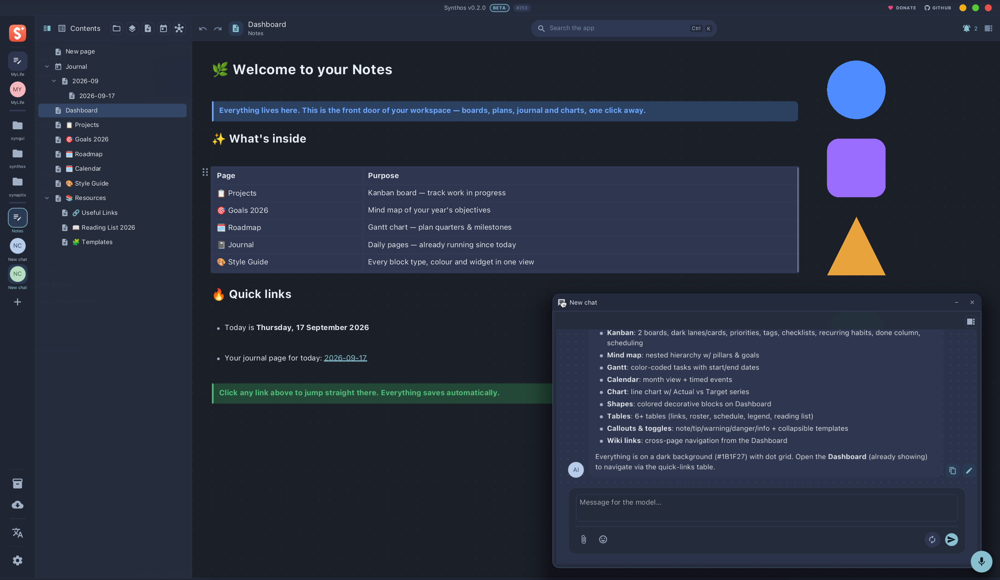

## What it is

synthos is one desktop app around a local GPU. A chat client runs 27B–125B models from
single-file `.syn` bundles and drives the rest of the app through tools; a notes mode holds
your documents, kanban boards, mind maps and calendar in a single project file; a node editor
wires generative models into runnable graphs — prompt → image, image + instruction →
edited image, text or image → video with sound, lyrics → music, script → multi-voice
dialogue, audio → transcript. The agent can build and run those
graphs itself, write into your notes, search your knowledge base and read the web. Nothing
leaves the machine.

## Install

**Arch Linux (AUR)**

```sh
paru -S synthos-bin      # prebuilt binary from the latest release — recommended
paru -S synthos-git      # build from source (needs CUDA toolkit, ~2 h, ~15 GB disk)
```

**Other distributions** — download the tarball from
[Releases](https://github.com/VitaminDB/synthos/releases) or build from source (see
[Build](#build)). The binary is built against Arch's library versions; on other
distributions building from source is the reliable path.

**Then pack your models** — synthos only loads `.syn` bundles, see
[the next section](#models-pack-them-into-syn-first).

## Models: pack them into `.syn` first

**synthos loads models only from `.syn` bundles.** A model downloaded from Hugging Face — a
folder of safetensors shards with `config.json` and tokenizer files, or a GGUF file — has to
be packed into a single `.syn` file before the chat, the node editor or the agent can use it.
It is a one-time step per model.

Why one file: the bundle is read zero-copy through mmap, carries the config, tokenizer and
chat template together with the weights, and can hold quantized weights — so the file on disk
is exactly what gets loaded, with nothing to resolve at runtime.

| | |
|---|---|
| 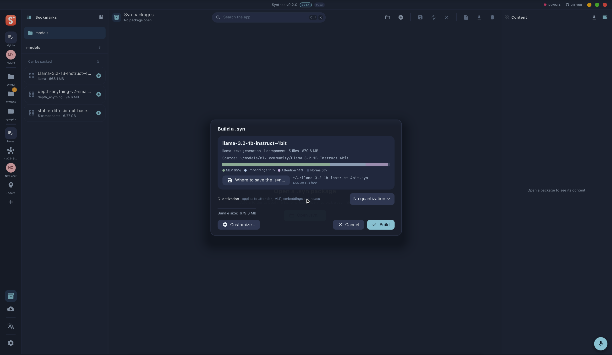 | 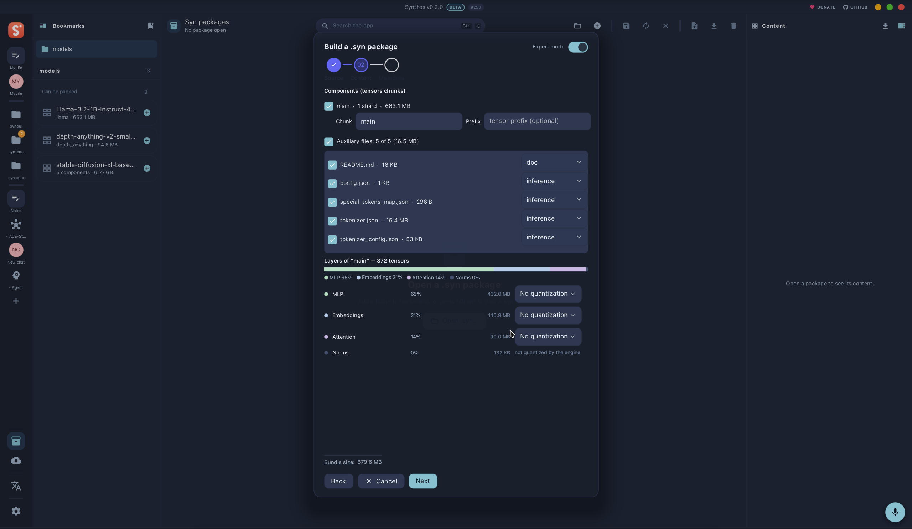 |
| **Build a .syn** — the model is recognised by itself; pick where to save and, optionally, a quantization | **Customize…** — components, auxiliary files, and precision per layer group |

**In the app:**

1. Put the downloaded model folder into your models directory (default `~/Storage/syn_models`,
   set in **Settings → AI models → Models directory**) or any other folder.
2. Open **Syn packages** in the left rail and add that folder to **Bookmarks**. Models that are
   not packed yet appear under **Can be packed**.
3. Click the model. **Build a .syn** detects the architecture, components and auxiliary files
   by itself — choose where to save, optionally pick a quantization, and press **Build**.
4. **Customize…** opens the full wizard: which components and auxiliary files go in, and the
   precision of each layer group (MLP, embeddings, attention).

**Other routes:**

- **GGUF** — the Hugging Face browser converts a downloaded GGUF to `.syn`; the `mmproj`
  vision projector is picked up automatically.
- **CLI** — `synaptix convert <source> <model.syn>` from
  [synaptix](https://github.com/VitaminDB/synaptix) does the same from a terminal.

**Before you press Build:**

- **Quantization (NVFP4 / MXFP8) needs an NVIDIA GPU and is lossy.** Keep the original
  weights if you quantize — the dialog will not combine quantization with "delete sources
  after packing".
- Large multi-part models have packing notes of their own: LTX-2.3 with its Gemma text
  encoder, MiniMax-H3, Muse Glimmer, Qwen3.8 and YuE2 — see `docs/*_syn_bundle_2026.md`
  and `docs/yue2_2026.md`.

## Features

### Chat and agent

- **Native inference from `.syn` bundles** — NVFP4 / MXFP8 quantization, CUDA-graph decode,
  MTP and DFlash speculative decoding, prefix-KV reuse across turns (including prompts that
  carry images), a VRAM-aware context budget with automatic compaction, and partial block
  offload that streams layers from host RAM when the model does not fit.
- **Models** — Qwen3 (dense and MoE), the Qwen3.6 / 3.8 hybrids (GatedDeltaNet + full
  attention), Qwen3.8-Flash-Next (125B MoE with a sparse-attention indexer, runs on a 24 GB
  card), Gemma-3, Gemma-4 26B A4B, Muse Glimmer 30B and Llama. Vision towers where the model
  has one — images and video go straight into the prompt.
- **Attachments** — images and video to the vision tower, documents inlined, audio
  transcribed on device; results of a pipeline run play right in the thread, in the same
  video player the node editor and the viewer use (audio-clocked, ±1 s jumps, seek on a
  paused frame).
- **Agent tools** — web search and read, knowledge-base retrieval, system status (VRAM / RAM,
  loaded models), **pipelines** (discover, build, edit and run node graphs from the chat,
  unloading itself for the run if VRAM is short), **notes** (full read/write access to pages,
  blocks, boards and the calendar), `view_media` (look at a file with the model's own vision),
  a `wizard` that asks you a multiple-choice question mid-turn, subagents, user-defined
  skills, and voice input. Tool schemas are not all declared up front: with **autotools** the
  model pulls the schema it needs on demand, which keeps the prefix-KV intact.
- **The thread stays fast and honest** — the feed is virtualized (a 400-message history
  re-renders in single-digit milliseconds), generation survives switching chats, messages you
  send mid-turn queue up instead of being dropped, and every message can be edited or deleted
  in place.
- **Per-chat setup** — a library of system prompts, sampling presets (per-model defaults or
  your own), reasoning depth, a collapsible card for each side panel, and a chat can be torn
  off into a floating window.

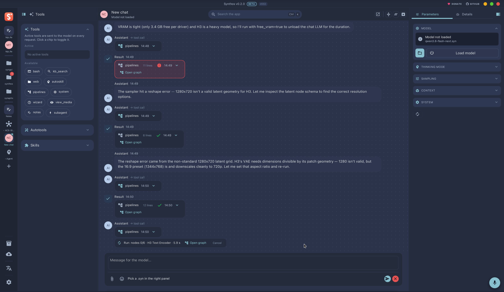

<details>
<summary>More chat screenshots</summary>

| | |
|---|---|
| 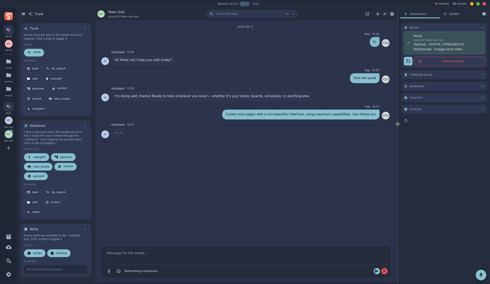 | 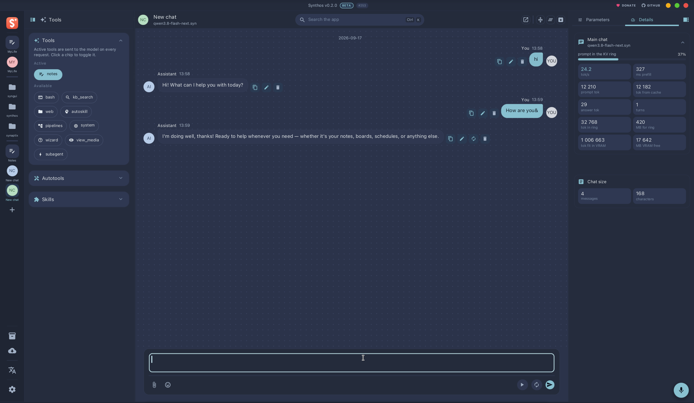 |
| Tools, the autotools pool and skills — toggled per chat | Details: tok/s, prefill time, and how much of the prompt came from the prefix-KV cache |
| 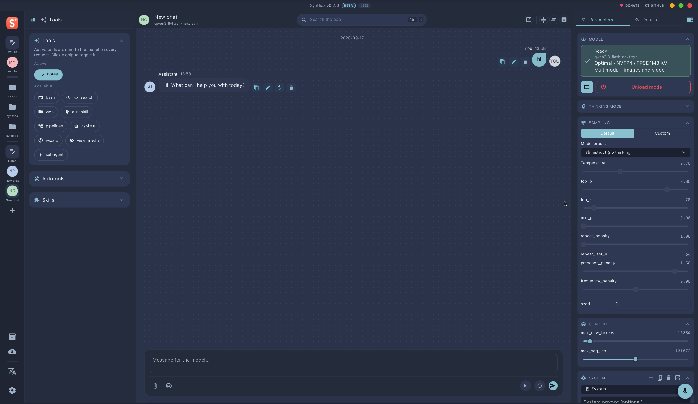 | 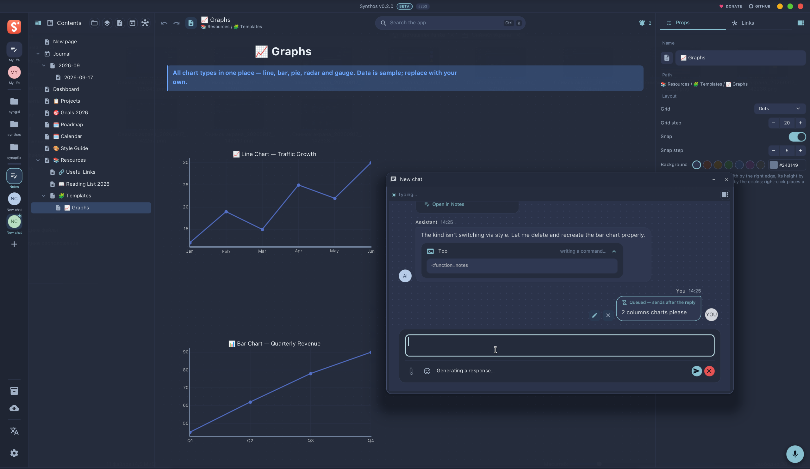 |
| Model card and sampling — per-model presets or your own | A floating chat over notes, with a message queued mid-turn |
| 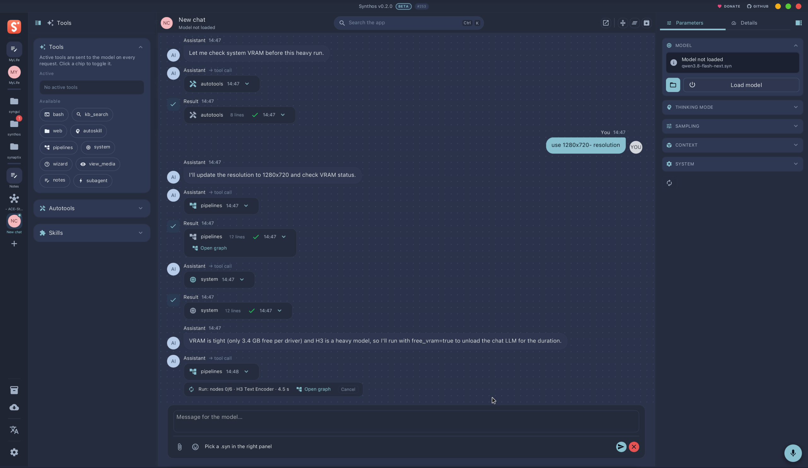 |  |
| The agent checks VRAM, frees it and starts a video run |  |

</details>

### Notes

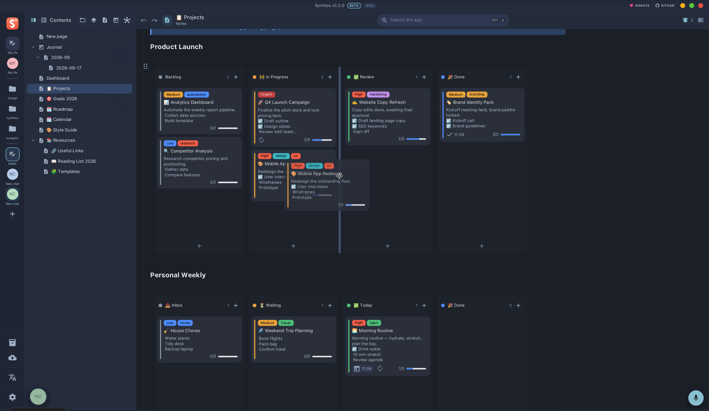

- **A project is one `.syn` bundle** — pages, attachments, boards and calendars live in a
  single file you can copy or back up.
- **Block editor** — WYSIWYG over Markdown: headings, lists, checklists, toggles, tables,
  syntax-highlighted code, callouts, media with players, and charts (line, bar, pie, radar,
  gauge). Slash menu, inline toolbar, undo/redo, multi-block selection.
- **Flow or canvas** — a page is a document or a free layout: drag blocks anywhere, snap to a
  5 px grid, pin width and height, draw shapes, arrows and Bézier curves between them, drop
  images and SVG.
- **Objects** — kanban boards (labels, priority, due date, checklists, per-column timers that
  archive or escalate stale cards), Gantt charts, mind maps and a calendar with month, week,
  day and agenda views, recurring events and reminders. Any of them can be embedded into a
  page with `![[kanban:id]]`.
- **Wiring** — `[[links]]` with autocomplete, a backlink index, a force-directed graph view,
  global search across pages, and attachments stored content-addressed.
- **Life management** — tasks, a project journal, repeating items, reminders that fire while
  the app runs, and an archive. The agent drives all of it through the `notes` tool.

<details>
<summary>More notes screenshots</summary>

| | |
|---|---|
| 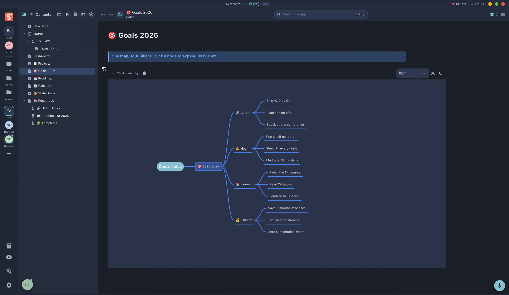 | 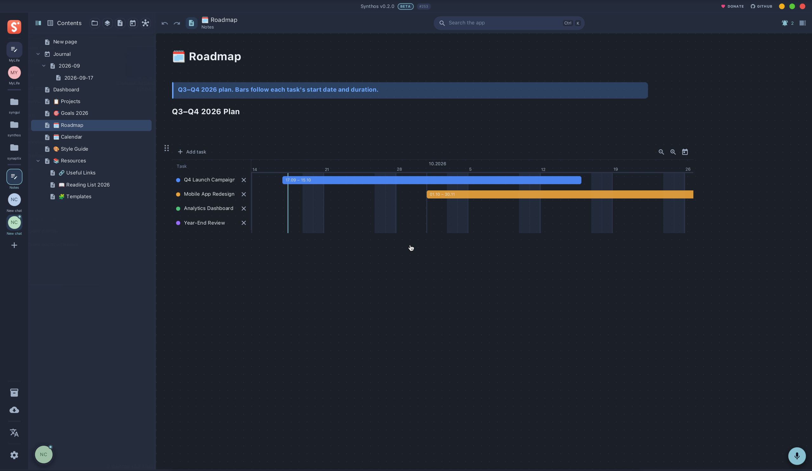 |
| Mind map | Gantt chart |
| 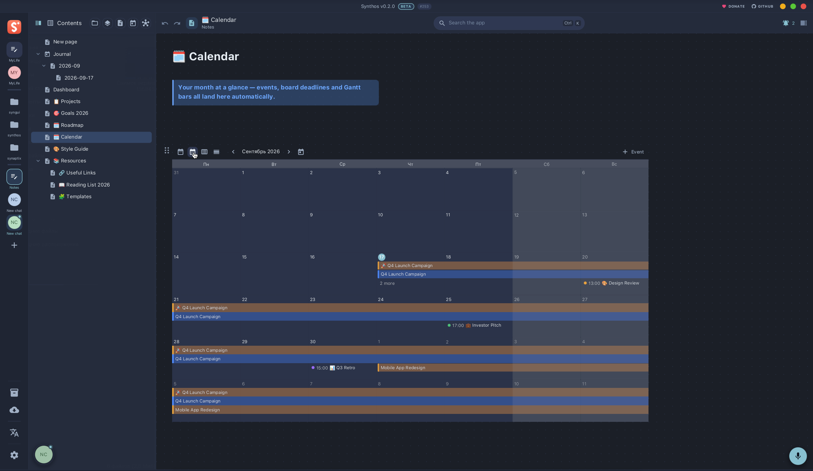 | 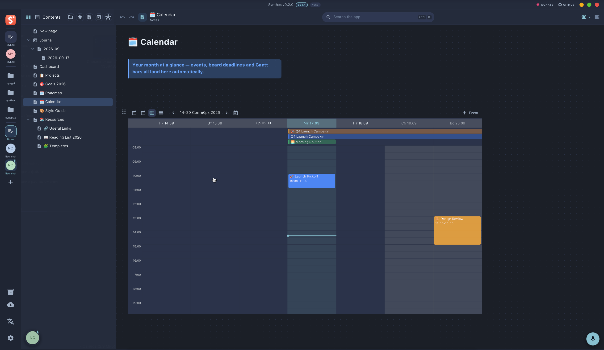 |
| Calendar, month view — events, board deadlines and Gantt bars | Calendar, week view |
| 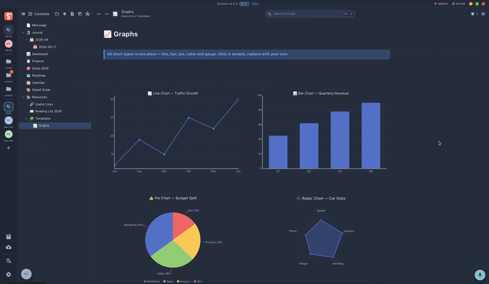 | 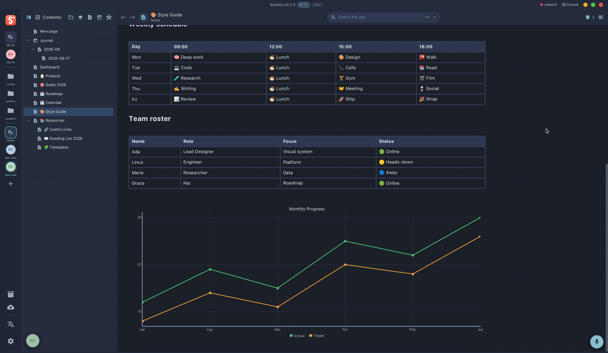 |
| Charts: line, bar, pie, radar | Tables and a chart on one page |
| 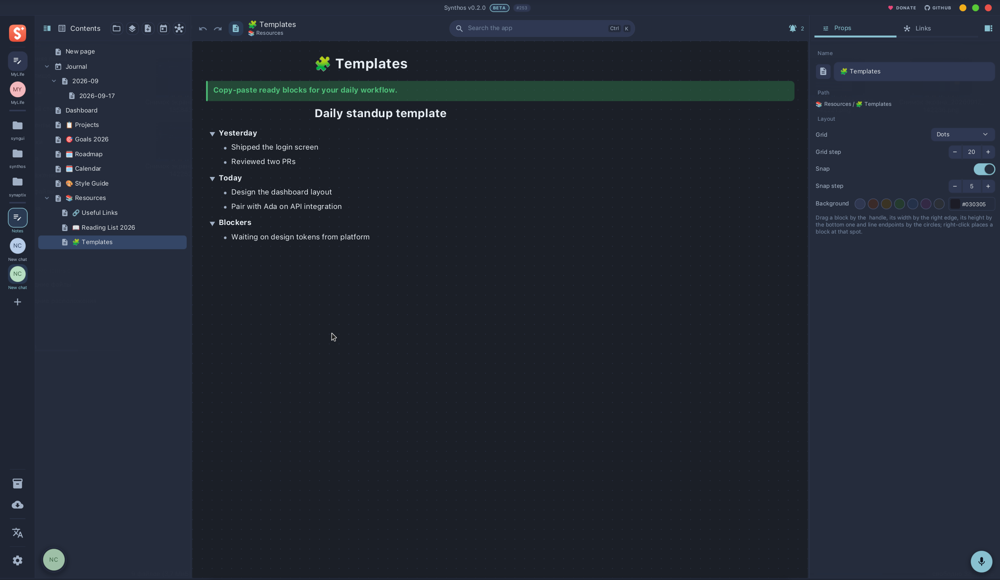 |  |
| Toggles, and page properties: grid, snap, background |  |

</details>

### Node studio

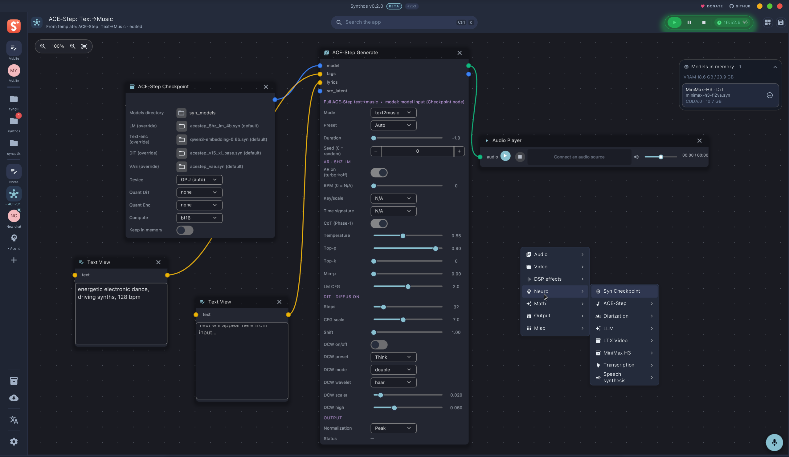

- **Images** — FLUX.1 (dev), FLUX.2 (dev 32B, klein 4B/9B, klein base) with img2img and
  up to ten references, Qwen-Image 2.1 (one model for text-to-image, editing by up to ten
  references and transparent RGBA output), Qwen-Image-Edit and Edit-2509/2511 (edit one
  picture, or compose up to four — "put the fox from the second picture on the rock from
  the first"), and SDXL for text-to-image and image-to-image. Weights run as NVFP4, MXFP8 or dense; the picture
  a graph produces can be fed straight into a video model as its first frame.
- **Video** — LTX-2.3: text-to-video, image-to-video, audio-to-video, IC-LoRA control from
  depth (Depth Anything V2) or canny edges, lip-dub and retake, two-stage sampling with a
  spatial upscaler. MiniMax-H3: text, first-frame or first+last-frame → video with
  synchronized stereo audio, plus Ref2VA — an ordered list of up to twelve image, video
  and audio references the model keeps identity and voice from; a 6-step turbo preset.
- **Music** — YuE2: style and lyrics become an editable melody-and-chord score in ABC,
  then a full song with vocals and accompaniment in 48 kHz stereo; the score comes out of
  the graph as text, so you can read it, change the harmony and render again, and the
  acoustic latents can be re-decoded with another decoder without generating twice.
  ACE-Step: generate, cover, edit, extend, extract, repaint, retake, with a per-stage
  progress readout.
- **Speech** — VoxCPM2 and OmniVoice text-to-speech with zero-shot voice cloning (the
  reference is transcribed automatically); VibeVoice for long-form multi-speaker dialogue
  from a `Speaker N:` script with up to four reference voices.
- **Transcription and diarization** — GigaAM ASR, Sortformer speaker diarization.
- **LLM** — a text-generation node inside the graph (e.g. the built-in "podcast from a topic"
  template: LLM → VibeVoice).
- **Audio** — recorder, file and FFmpeg players, mixer with dynamic inputs, 6/10/20/30-band
  equalizers, filter, gain, reverb, save-to-file; PCM streams between nodes.
- **Editor** — checkpoint nodes (ComfyUI-style) with a "keep in memory" switch per model
  family, built-in templates for every family (FLUX / FLUX.2 text-to-image, edit and
  multi-reference, Qwen-Image 2.1 text-to-image, edit, multi-reference, transparent RGBA
  and LLM prompt rewrite, Qwen-Image edit and multi-image edit, SDXL text-to-image and
  image-to-image, LTX and H3 video, music, podcast) plus your own, multi-tab graphs, run/pause/stop, per-node and
  per-run timers, a panel of loaded models, workspace autosave, Markdown annotation nodes.

<details>
<summary>More node editor screenshots</summary>

| | |
|---|---|
| 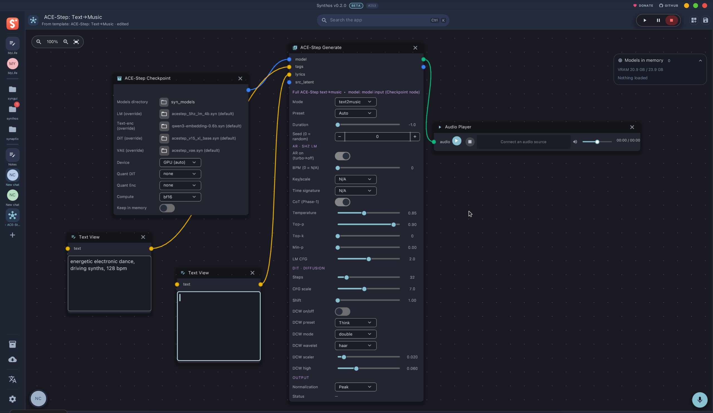 |  |
| ACE-Step text → music graph with checkpoint, generator and player |  |

</details>

### Code editor

- Tree view with live git-status decorations, external-change watching, syntax highlighting,
  integrated terminals. With no file open the editor steps aside and the terminal takes the
  centre.

| | |
|---|---|
| 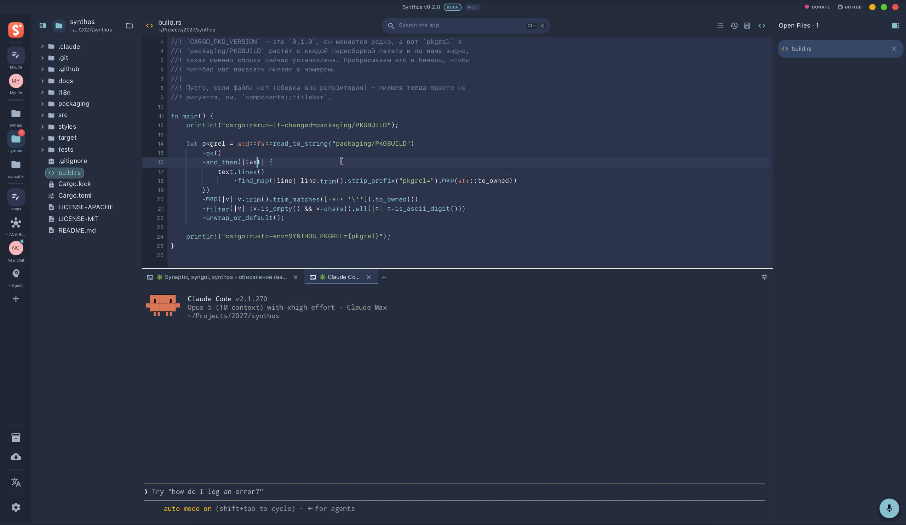 | 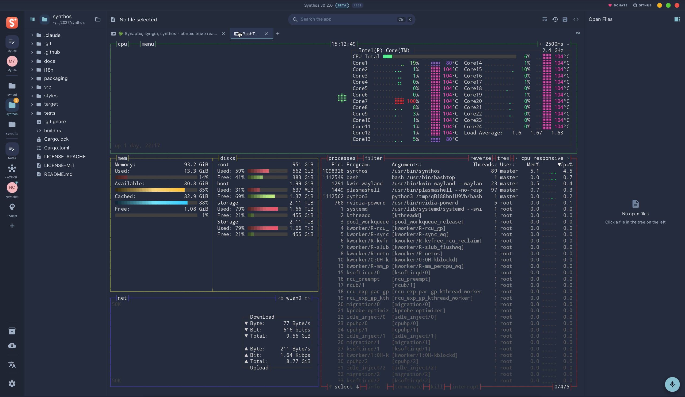 |
| Code editor with the integrated terminal | The terminal runs full-screen TUIs |

### Knowledge base (RAG)

- Local document collections (files, folders, PDF, URL), hybrid BM25 + vector search and an
  optional cross-encoder rerank — computed on-device, stored in bundled SQLite.

### Models

- A Hugging Face browser for fetching models, with GGUF import converted in-app to `.syn`;
  downloads run in a dock at the bottom of the window (list or icon view, per-file progress,
  a progress chip in the title bar) and survive navigating away.
- A model catalogue in Settings — one `.syn` file per model, read zero-copy via mmap, with
  "optimal" and "custom" profiles per model.
- **Syn packages** — pack models into `.syn` (see
  [above](#models-pack-them-into-syn-first)), inspect, edit and re-pack bundles, with
  quantization applied at packing time.

### Desktop

- A global voice-input overlay (FAB) on every page, with history.
- System appearance: follows the desktop's light/dark scheme, accent colour, title-bar
  buttons and backdrop blur. UI scale for HiDPI.
- The interface ships in 14 languages (en, ru, de, es, fr, it, ja, kk, ko, pl, pt-BR, tr, uk,
  zh-CN).

## Performance

Measured on an RTX 5090 Laptop (24 GB) with 93 GB of system RAM — a single consumer machine,
not a server card:

| Model | Prefill | Decode |
|---|---|---|
| Gemma-4 26B A4B | 10 100 tok/s (4k prompt) | 210 tok/s |
| Qwen3.8-27B hybrid | 1 450 tok/s (3.3k prompt) | 47 tok/s (MTP + CUDA graph) |
| Qwen3.8-Flash-Next 125B MoE | 1 650 tok/s at a 260k context | 17–22 tok/s |

The 125B model holds a 262k-token context on a 24 GB card: experts live in pinned host RAM
and stream in at ~39 GB/s, the KV cache is MXFP8, and prefill runs layer-by-layer so a long
prompt never needs three copies of the activation stream. A 3k-token follow-up turn on top of
an 80k history takes 3.3 s thanks to prefix-KV reuse.

Image generation on the same card, 1024²: SDXL 30 steps in 6.5 s, Qwen-Image 2.1 40 steps
in 30 s (MXFP8, 13.6 GB peak) or 23 s (NVFP4) — 2048² in 172 s, Qwen-Image-Edit-2511
40 steps in 188 s (MXFP8, 17.8 GB peak) or 155 s (NVFP4), FLUX.2 klein 4 steps in a few
seconds.

**A 7 GB card is enough for all of it.** Every model family was measured with a ballast
process holding all but 7 GB of VRAM: chat models from 27B to a 125B MoE, Gemma-4, FLUX.1,
FLUX.2, MiniMax-H3, LTX-2.3, ACE-Step with its 4B LM, VibeVoice. What does not fit streams
from RAM (or from the mmapped bundle), so the limit is patience rather than capacity — a
27B hybrid answers at 1–2 tok/s with 7 of its 64 blocks resident, while FLUX.2 klein still
draws a 1024² image in 2–3 s. Details in `docs/small_vram_7gb_2026.md`.

## Build

synthos is a Cargo workspace that path-depends on its two sibling repositories. Check all
three out next to each other:

```
~/Projects/
├── syngui/
├── synaptix/
└── synthos/
```

```sh
cargo build --release            # or --profile fast-release for iteration
```

The build needs stable Rust 1.96 or newer (the floor set by dependencies), the CUDA
toolkit (`nvcc` is read at build time to pin the CUDA API version; the driver itself is
loaded dynamically at runtime) and system FFmpeg development libraries. An Arch package is in [`packaging/`](packaging/) — `cargo build --release` first,
then `makepkg` against the existing binary.

## Requirements

- Linux x86_64. Runtime: gtk3, wayland, libxkbcommon, fontconfig, a Vulkan driver, alsa,
  ffmpeg.
- GPU (optional, strongly recommended): NVIDIA driver + CUDA runtime, loaded at runtime. The
  compile baseline is sm_80 (Ampere); native NVFP4 needs sm_120 (Blackwell). 7 GB of VRAM is
  enough to run everything, 24 GB to run it quickly. Without a GPU the node engine falls back
  to CPU for smoke tests and debugging.
- A Windows build is planned — the app currently depends on Linux-only components.

## Models and licences

No model weights are shipped. Download them yourself from Hugging Face — the same files used
by ComfyUI / LM Studio — and you accept each model's licence. Some models (e.g. FLUX.1-dev,
LTX-2.3, Gemma-3) are non-commercial or otherwise restricted; check the licence before use.
Every model must be packed into a `.syn` bundle before use — see
[Models: pack them into `.syn` first](#models-pack-them-into-syn-first).

## Documentation

Feature notes and design write-ups live in [`docs/`](docs/) (Russian) — including the
performance analyses quoted above (`qwen4exp_perf_2026.md`, `gemma4_2026.md`,
`block_offload_2026.md`).

## Related

- [syngui](https://github.com/VitaminDB/syngui) — the GUI framework.
- [synaptix](https://github.com/VitaminDB/synaptix) — the inference and training engine.

## How it is built

One developer, with Claude (Anthropic) as a daily coding assistant. The architecture, the
engine work and the benchmarks above are mine; the assistant carries a large share of the
typing, the tests and the refactors.

## Support

synthos is free and open source, written by one person. If it is useful to you, you can
support its development with a donation via [PayPal](https://paypal.me/vitamindbnfkz).

## Licence

MIT OR Apache-2.0 — see [LICENSE-MIT](LICENSE-MIT) and [LICENSE-APACHE](LICENSE-APACHE).
